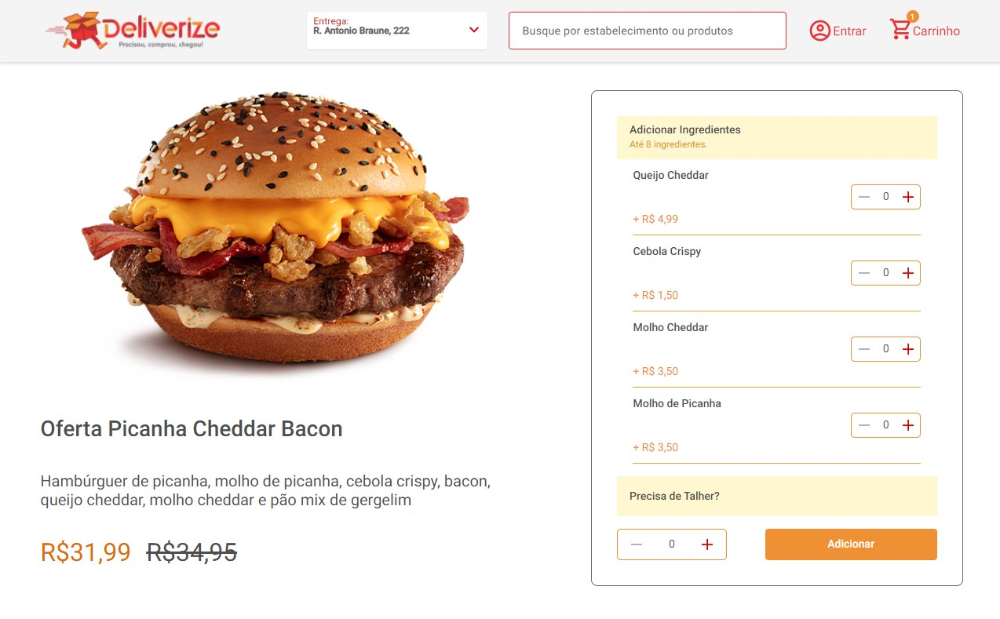

# Desafio TeamSoft - Desenvolvedor Front-end Jr
O objetivo do projeto é a construção de um front-end, seguindo as instruções contidas no [repositório principal](https://github.com/Teamsoftbr/join-frontend).

> O seu desafio é codificar esse [layout](https://www.figma.com/file/1RWDOOFeh5836Y4KruOl5w/FrontEnd?node-id=0%3A1).

### ✅ To Do List

- [x] Funcionalidade adicionar ingrediente
- [x] Funcionalidade remover ingrediente

## 🚀 Tecnologias utilizadas
- ReactJS
- Sass
- TypeScript
- Axios
- ViteJS

## 💻 Como rodar

1. Clonar [este projeto](https://github.com/lineavelino/desafio-teamsoft) usando `git clone`;
2. Entrar na pasta e instalar as dependências com `yarn`;
3. Rodar o projeto usando `yarn dev`
4. Abra localhost 3001 para vê-lo em seu browser.
